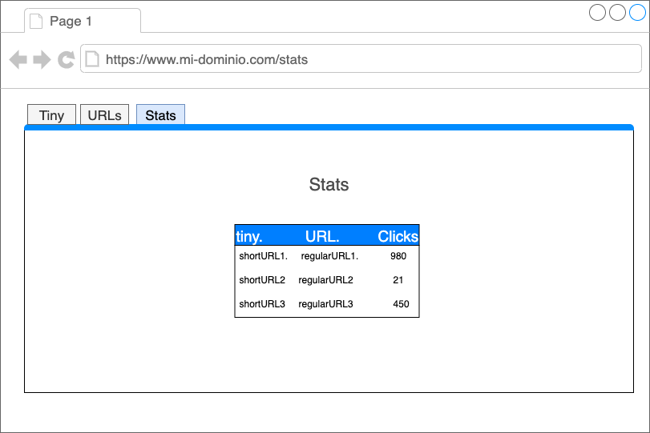

## Stats

En esta vista se mostraran las estadisticas de cada URL.

- Tiny URL
- Original URL
- Visitas: cantidad de visitas que esa URL ha tenido.

| tinyURL                       	|                Original URL                	| Visitas |
|-------------------------------	|:------------------------------------------|:------------------------------------------|
| http://mi-dominio.com/sasd3av 	| https://miu.ufm.edu/mis_cursos_detalle.php 	| 4 |
| http://mi-dominio.com/1wsqzdf 	| https://docs.google.com/document/d/1       	| 23|
| http://mi-dominio.com/correo  	| https://mail.google.com/mail/u/            	| 50 |

Para esto ud debe ingeniar como guardar (que key usar) para el valor de los visitas, un visita cuenta como cada vez que un tinyURL es usado; esta seccion es muy similar [a la anterior](/url-list) con la añadicion de las visitas.

Para esta parte debe ir a la DB a traer:

- tinyURL,OriginalURL (key,val)
- Visitas para esa tinyURL (key= tinyURL_visits, val = N)

## Mockup

> observe la ruta en el mockup

